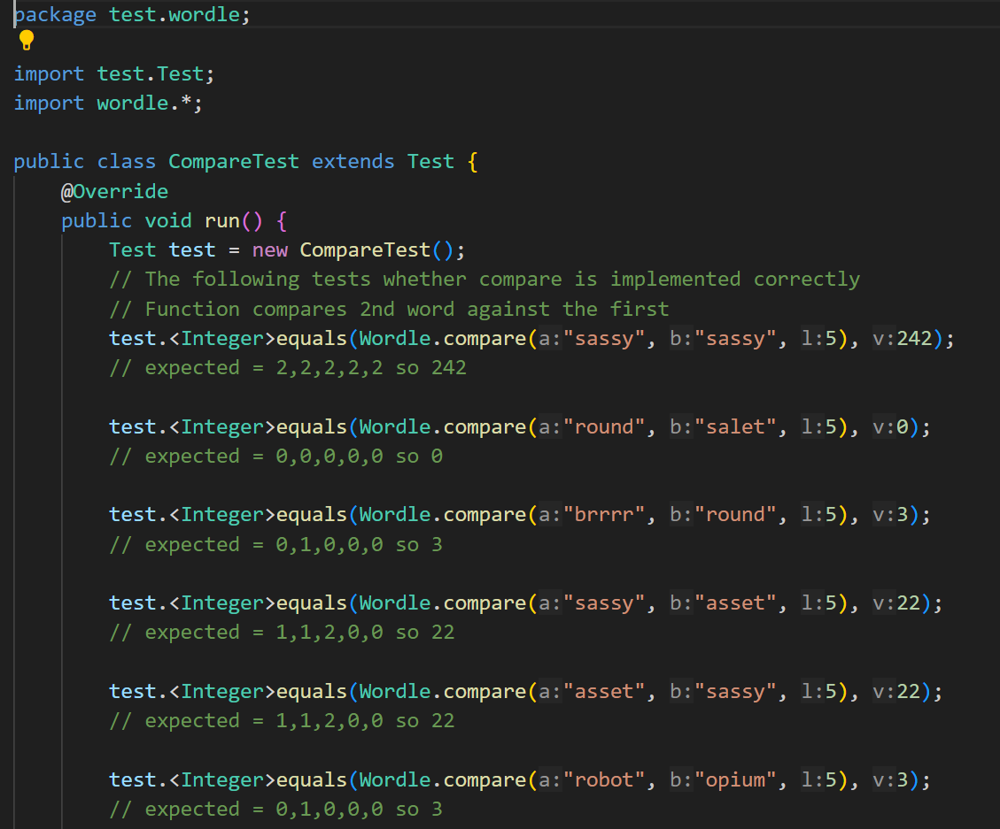
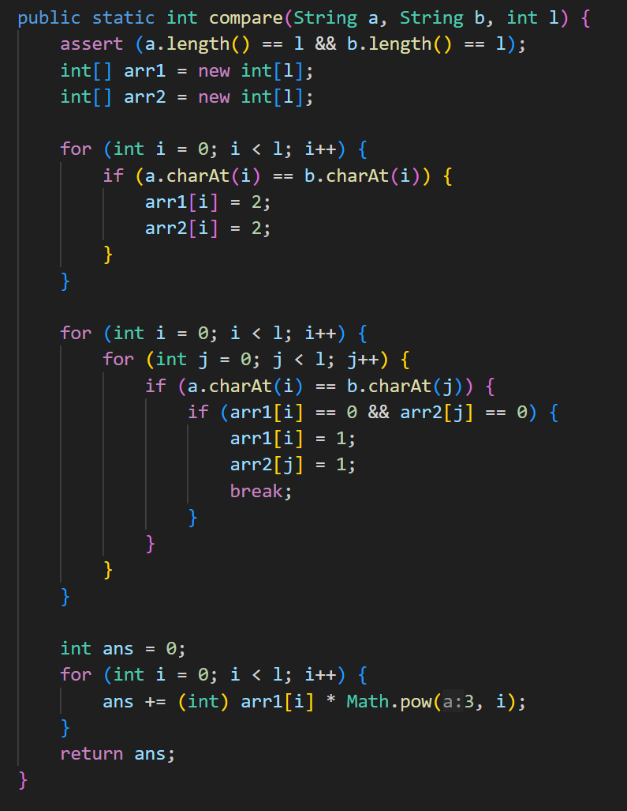
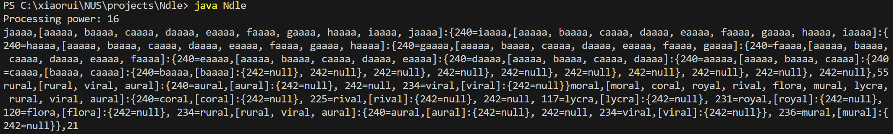
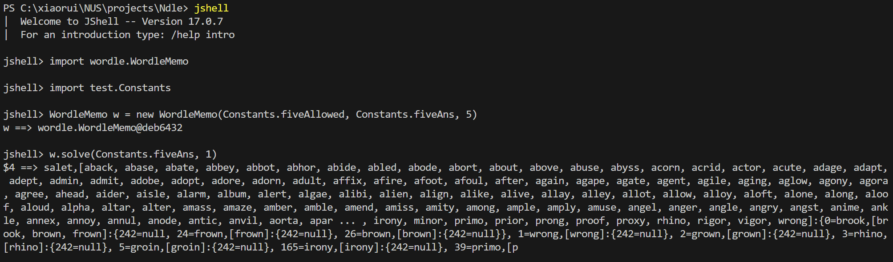
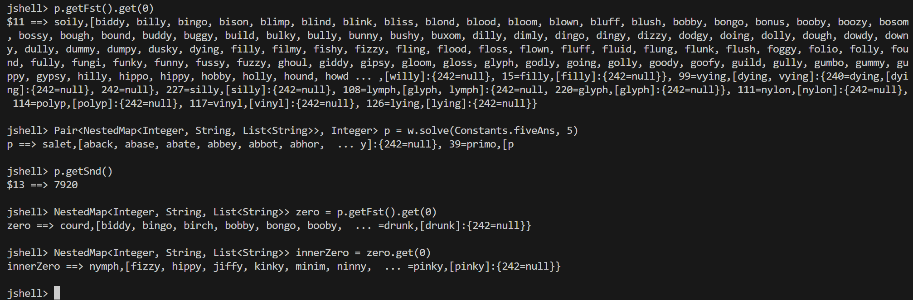

# Ndle

A [Wordle](https://www.nytimes.com/games/wordle/index.html) [^1] solver that finds the minimum number of total guesses recursively. Each step, for each allowed guess, we count the number of groups the possible answers are partitioned into. Those with the largest number of groups are listed as candidates for the best guess and the process continues recursively until there is only 1 possibility left. Other approaches to shortlist candidates are also considered, such as by entropy, by maximum bucket size, and by quadratic sum. 

The Wordle solver is fairly accurate and efficient, able to find a best solution(minimum average number of solves) in ~20 seconds. You may play with an interactive version [here](https://freshman.dev/wordle/leaderboard), under Xiaorui. Variants of Wordle are also explored; in particular, an efficient [Dordle](https://dordlegame.io/) solver is still a work in progress. An interesting variant explored is using ```k > 1``` fixed starting words. Wordle Hard mode may also be explored in future.

Below are screenshots of some code from Wordle.java, which is written in Java:
<figure>
  
  <figcaption>Sample Test Case</figcaption>
  
  <figcaption>Function that returns the output of comparing 2 strings.</figcaption>
</figure>


# Running The App

To run the app locally, [clone](https://docs.github.com/en/get-started/quickstart/fork-a-repo#cloning-your-forked-repository) the repo and make sure you have Java 17 or above on your local machine. 

The entire application is written in Java and meant to be run in the command line. There are 2 main ways to use the application; the first is to run the main function in Ndle.java. You can compile the java files in each sub-folder(javac path/to/file/*.java, e.g. javac Ndle.java or javac wordle/*.java), or use Intellij and simply run Ndle.java.

<figure>
  
  <figcaption>Sample run</figcaption>
</figure>

The second is to use jshell. The advantage of this method is that you can go into the sub-branches of the decision tree by using tree.get(x), where x is an integer that represents the outcome. The convention I chose is to represent black, yellow, and green with 0, 1, and 2 respectively. Then, read the digits from the right to left(instead of the usual left to right for implementation simplicity) as an number in base-3.

<figure>
  
  
  <figcaption>Sample run for sub-branches, import classes if necessary! 7920 represents minimum total tries needed across all words. </figcaption>
</figure>

Enjoy!

[^1]: New York Times modified the answer list slightly after acquiring Wordle, but the answer and allowed word lists are using the originals. 


